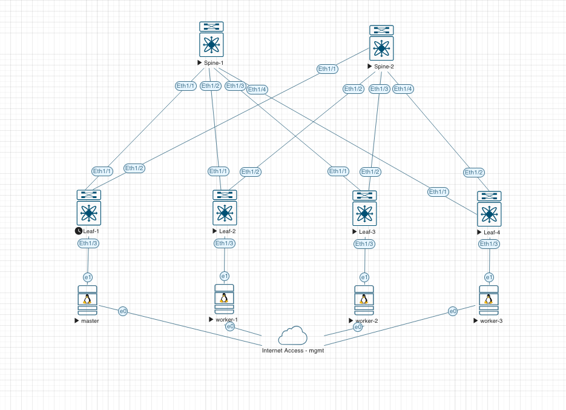

# Kubernetes + Cilium on a VXLAN BGP EVPN Clos Fabric

A reproducible lab that builds a production-shape data center network from the physical fabric up through Kubernetes service load balancing, with every layer validated by automated sanity checks.

**What this is:**
- A 2-spine, 4-leaf Cisco Nexus 9000v Clos fabric in EVE-NG
- OSPF + iBGP (with route reflectors) underlay
- VXLAN BGP EVPN overlay with symmetric IRB, anycast gateway, and a tenant VRF
- A 4-node Kubernetes 1.31 cluster (kubeadm, bare metal-style on Ubuntu 24.04 VMs)
- Cilium 1.18.4 with eBPF datapath, kube-proxy replacement, and node-to-node BGP peering
- LoadBalancer VIPs advertised across a multi-hop Clos fabric via Cilium BGP
- 62 automated sanity checks that verify everything end-to-end, plus a reboot-durability test

Built as a companion to a three-part blog series on [levelupit.xyz](https://levelupit.xyz).

---

## Why this lab exists

Most Cilium BGP tutorials peer nodes with a single ToR on the same subnet. Real data centers aren't built that way. Real fabrics are multi-hop Clos with eBGP between Kubernetes nodes that live behind different leaves in different racks, often with EVPN overlay for multi-tenancy and host mobility.

This lab demonstrates that entire stack working together, including the subtle gotchas you only hit when you stop copying Kubernetes tutorials and start building fabrics the way hyperscalers build them.

---

## Topology



**Physical layout:**
- **Spine-1, Spine-2** (Nexus 9000v): fabric transit + iBGP route reflectors (loopbacks 10.0.0.1 and 10.0.0.2)
- **Leaf-1 through Leaf-4** (Nexus 9000v): VTEPs at the edge (loopbacks 10.0.0.11-14), each hosting one Kubernetes node per rack
- **master, worker-1/2/3** (Ubuntu 24.04): Kubernetes nodes, each connected to a single leaf's `Eth1/3` via `ens4` for the fabric interface, with `ens0` on the management network for SSH and image pulls

**Logical overlays running on top:**
- OSPF area 0 underlay between loopbacks
- iBGP AS 65000 with spines as route reflectors (IPv4 unicast + L2VPN EVPN)
- VXLAN BGP EVPN with anycast gateway (MAC `2020.0000.00aa`)
- Cilium node-to-node eBGP: 12 sessions total (4 nodes × 3 peers each), each node in its own AS (65201-65204)
- Cilium LoadBalancer VIPs: `192.168.100.0/24` advertised from every node to every peer
- Tenant VRF `tenant-1` carries rack subnets via L3 VNI `50001`
- Per-rack L2 VNIs: `10011, 10012, 10013, 10014` (one per leaf, mapped to VLANs 11-14)

---

## Repository structure

```
├── README.md                          ← you are here
├── LICENSE
├── .gitignore
│
├── docs/
│   └── topology.png                   ← the diagram above
│
├── fabric-configs/                    ← NX-OS configs for all 6 switches
│   ├── spine-1.cfg      spine-2.cfg
│   ├── leaf-1.cfg       leaf-2.cfg
│   ├── leaf-3.cfg       leaf-4.cfg
│
├── host-configs/                      ← Linux netplans for the 4 nodes
│   ├── master-60-fabric.yaml
│   ├── worker-1-60-fabric.yaml
│   ├── worker-2-60-fabric.yaml
│   └── worker-3-60-fabric.yaml
│
├── k8s-cilium-lab/
│   ├── manifests/                     ← All 8 Kubernetes/Cilium manifests
│   │   ├── kubeadm-init.yaml
│   │   ├── cilium-values.yaml         ← Helm values for Cilium install
│   │   ├── bgp-peer-config.yaml       ← CiliumBGPPeerConfig
│   │   ├── bgp-cluster-configs.yaml   ← CiliumBGPClusterConfig (per node)
│   │   ├── bgp-advertisement.yaml     ← CiliumBGPAdvertisement
│   │   ├── lb-pool.yaml               ← CiliumLoadBalancerIPPool (VIPs)
│   │   ├── ai-workloads.yaml          ← Sample Deployments + Services
│   │   └── test-client.yaml
│   ├── scripts/
│   │   ├── system-prep.sh             ← Host prep (modules, sysctl, swap)
│   │   └── hosts-entries.sh
│   └── join.sh                        ← Worker join helper
│
├── k8s_cilium_lab.sh                  ← Main build (11 phases)
├── lab_sanity.sh                      ← 62 end-to-end checks
├── install_cilium_cli.sh
├── check_persistence.sh               ← Cluster-wide persistence snapshot
├── worker_check_persistence.sh        ← Per-node host persistence snapshot
│
└── evidence/                          ← Validation artifacts (real logs)
    ├── sanity-runs/
    │   ├── stage-1-initial-build-40-checks.log
    │   ├── stage-2-with-vip-matrix-48-checks.log
    │   └── stage-3-evpn-final-62-checks.log
    ├── reboot-tests/
    │   ├── 01-baseline-before-reboot.log
    │   ├── 02-baseline-after-reboot.log
    │   ├── 03-diff-shows-only-ephemeral-changes.log
    │   ├── 04-implicit-post-reboot-verification.log
    │   └── 05-additional-reboot-snapshot.log
    └── install-logs/
        ├── kubeadm-init.log
        ├── cilium-install.log
        ├── join-worker-{1,2,3}.log
        └── ...
```

---

## Address plan

| Element | Range | Notes |
|---------|-------|-------|
| Loopbacks | 10.0.0.1 ... 10.0.0.14 | /32 on every switch |
| Spine-leaf P2P | 10.100.1.0/24 + 10.100.2.0/24 | /31 per link |
| Rack 1 (master) | 10.1.1.0/24 | VLAN 11, L2 VNI 10011 |
| Rack 2 (worker-1) | 10.1.2.0/24 | VLAN 12, L2 VNI 10012 |
| Rack 3 (worker-2) | 10.1.3.0/24 | VLAN 13, L2 VNI 10013 |
| Rack 4 (worker-3) | 10.1.4.0/24 | VLAN 14, L2 VNI 10014 |
| Pod CIDR | 10.10.0.0/16 | Cilium |
| Service CIDR | 10.96.0.0/12 | Kubernetes |
| LoadBalancer VIPs | 192.168.100.0/24 | Advertised via Cilium BGP |
| Tenant L3 VNI | 50001 | `tenant-1` VRF |

## ASN plan

| Device | ASN | Role |
|--------|-----|------|
| Spine-1, Spine-2, Leaves | 65000 | Fabric iBGP |
| master | 65201 | Cilium BGP |
| worker-1 | 65202 | Cilium BGP |
| worker-2 | 65203 | Cilium BGP |
| worker-3 | 65204 | Cilium BGP |

Fabric iBGP is one flat AS with route reflectors. Cilium runs eBGP between nodes, one AS per node, full mesh across the Clos.

---

## Validation evidence

This isn't a theoretical design. Every layer has been built and tested live. See [`evidence/`](./evidence/) for real output from the lab.

| Log | Shows |
|-----|-------|
| [`stage-3-evpn-final-62-checks.log`](./evidence/sanity-runs/stage-3-evpn-final-62-checks.log) | **62/62** sanity checks passing with the full EVPN overlay active |
| [`stage-2-with-vip-matrix-48-checks.log`](./evidence/sanity-runs/stage-2-with-vip-matrix-48-checks.log) | 48/48 checks including the full BGP VIP propagation matrix (48 inbound routes across the mesh) and live withdraw/restore demo |
| [`stage-1-initial-build-40-checks.log`](./evidence/sanity-runs/stage-1-initial-build-40-checks.log) | Initial build validation (L3 fabric only, pre-EVPN) |
| [`03-diff-shows-only-ephemeral-changes.log`](./evidence/reboot-tests/03-diff-shows-only-ephemeral-changes.log) | Before-vs-after-reboot diff. Only uptimes and ages change. Everything structural survives. |
| [`install-logs/`](./evidence/install-logs/) | kubeadm bootstrap, Cilium Helm install, worker join output from the actual build |

Every claim in the blog series links back to a specific log here.

---

## Quickstart

### Prerequisites

- EVE-NG Community or Pro with Nexus 9000v image (tested on 10.5.2)
- Parallels Desktop or equivalent hypervisor for 4 Ubuntu 24.04 ARM64 VMs
- 16 GB RAM minimum; 32 GB comfortable
- macOS or Linux workstation

### Build order

1. **Fabric:** Import configs from `fabric-configs/` into each switch. Verify OSPF adjacencies and iBGP sessions come up before proceeding.
2. **Hosts:** Apply netplans from `host-configs/` to each VM's `/etc/netplan/60-fabric.yaml`, then `sudo netplan apply`.
3. **Kubernetes + Cilium:** Run `bash k8s_cilium_lab.sh` on the master. Completes in under 10 minutes.
4. **Validate:** Run `bash lab_sanity.sh`. Expect **62/62** passing.

### Verify fabric health at any stage

```bash
# Cilium BGP health
cilium bgp peers                       # expect 12 established

# VIP propagation
bash lab_sanity.sh                     # expect 62/62 passed

# Data-plane end-to-end
for vip in 192.168.100.0 192.168.100.1 192.168.100.2 192.168.100.3; do
  curl -s -o /dev/null -w "VIP $vip: HTTP %{http_code}\n" http://$vip/
done

# Persistence
bash check_persistence.sh > /tmp/before.log
# ... reboot all hosts ...
bash check_persistence.sh > /tmp/after.log
diff /tmp/before.log /tmp/after.log    # only ages/uptimes should change
```

---

## Gotchas this lab taught me

Each of these cost me real debug time. They're all documented with context and fix in the blog series.

### Cilium BGP

1. **`CiliumBGPClusterConfig.spec.bgpInstances[].localPort` defaults to -1**, meaning no BGP listener starts. You must set it explicitly to 179. The field is named `localPort`, not `listenPort`.
2. **`NET_BIND_SERVICE` capability** is not in cilium-agent's default caps list, but is required to bind :179 (a privileged port). Add it via Helm `securityContext.capabilities.ciliumAgent`.
3. **`helm upgrade --reuse-values` can nil-pointer** when chart version drifts. Safer to manage Cilium install via a pinned values file, not reuse-values.
4. **eBGP across a multi-hop Clos fabric requires `ebgpMultihop`**. Default TTL of 1 dies at the first-hop leaf, invisible to both sides (no SYN arrives, no RST returns). Set `CiliumBGPPeerConfig.spec.ebgpMultihop: 10`.

### NX-OS EVPN

5. **Spines need `feature nv overlay` and `nv overlay evpn` too**, even though they don't terminate VXLAN tunnels. Without these, `address-family l2vpn evpn` under `router bgp` is silently rejected.
6. **`suppress-arp` requires TCAM carving.** `hardware access-list tcam region arp-ether 256 double-wide` + reload. Apply on all leaves before enabling ARP suppression.
7. **`advertise l2vpn evpn` is deprecated** in newer NX-OS. No longer needed under `vrf / address-family ipv4 unicast` — redistribution into EVPN is now implicit. Harmless warning, but cleaner to remove.

Bonus design gotcha: **routed access ports don't scale.** The first version of this lab had each host connected via a dedicated `no switchport` + IP port. Converting to L2 access + SVI anycast gateway is a prerequisite for EVPN and is how real ToRs are built.

---

## What to read if you want just one thing

- **Curious about Cilium BGP?** → read [`k8s-cilium-lab/manifests/bgp-cluster-configs.yaml`](./k8s-cilium-lab/manifests/bgp-cluster-configs.yaml) + [`bgp-peer-config.yaml`](./k8s-cilium-lab/manifests/bgp-peer-config.yaml)
- **Curious about the fabric?** → read [`fabric-configs/leaf-1.cfg`](./fabric-configs/leaf-1.cfg) (a representative leaf) + [`spine-1.cfg`](./fabric-configs/spine-1.cfg)
- **Curious if it actually works?** → read [`evidence/sanity-runs/stage-3-evpn-final-62-checks.log`](./evidence/sanity-runs/stage-3-evpn-final-62-checks.log)
- **Curious about my lab validation approach?** → read [`lab_sanity.sh`](./lab_sanity.sh)

---

## Blog series

A three-part deep-dive walks through building this lab from scratch, with emphasis on architectural decisions, tradeoffs, and the specific gotchas at each layer.

- Part 1: Cilium BGP across a Clos fabric (eBGP between K8s nodes, the four Cilium gotchas)
- Part 2: From routed access ports to SVI anycast gateways (why ToRs are built the way they are)
- Part 3: Adding VXLAN BGP EVPN (what it buys, what it doesn't, and the EVPN-specific gotchas)

Posts published at [levelupit.xyz](https://levelupit.xyz).

---

## Software versions

| Component | Version |
|-----------|---------|
| NX-OS | 10.5(2) |
| Ubuntu | 24.04 LTS (ARM64) |
| containerd | 2.2.1 |
| Kubernetes | 1.31.14 |
| Cilium | 1.18.4 |
| Hubble Relay | bundled with Cilium 1.18.4 |
